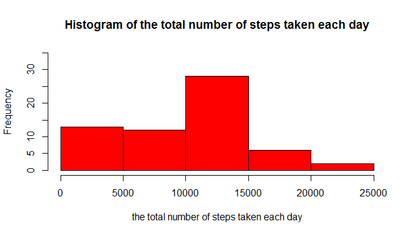
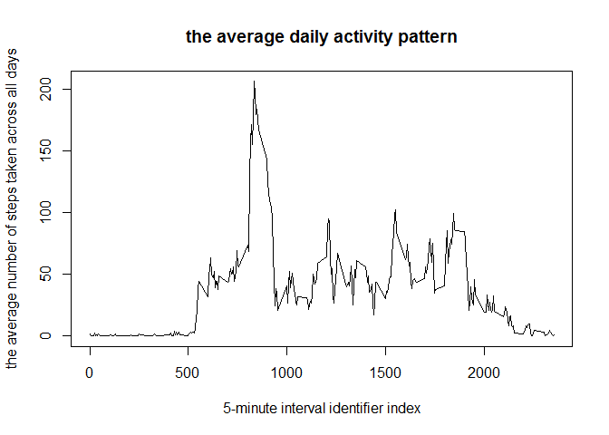
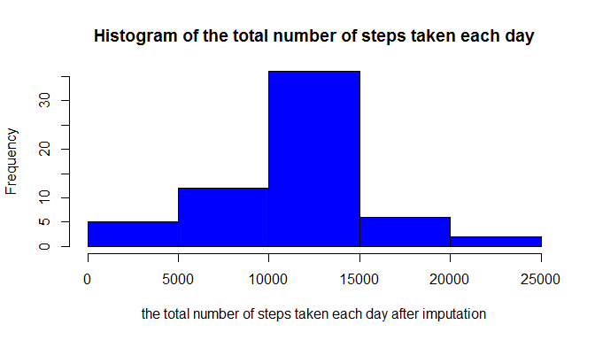

Loading and preprocessing the data
----------------------------------

1.  Load the data

``` r
data <- read.csv("activity.csv")
```

1.  Process/transform the data (if necessary) into a format suitable for your analysis

``` r
data$datetime <- strptime(data$date, "%Y-%m-%d") # convert into date class
data$interval <- factor(data$interval)
```

What is mean total number of steps taken per day?
-------------------------------------------------

1.  Calculate the total number of steps taken per day

``` r
total_num_steps <- sapply(split(data$steps, data$date), sum, na.rm=TRUE) # NAs ignored
print(head(total_num_steps))
```

    ## 2012-10-01 2012-10-02 2012-10-03 2012-10-04 2012-10-05 2012-10-06 
    ##          0        126      11352      12116      13294      15420

1.  Make a histogram of the total number of steps taken each day

``` r
hist(total_num_steps, col="red", ylim = c(0,35),
        main = "Histogram of the total number of steps taken each day",
        xlab = "the total number of steps taken each day")
```



1.  Calculate and report the mean and median of the total number of steps taken per day

``` r
mean_total_num_steps <- mean(total_num_steps, na.rm = TRUE)
median_total_num_steps <- median(total_num_steps, na.rm=TRUE)
```

The mean of the total number of steps taken per day is **9354.23**.
The median of the total number of steps taken per day is **10395**.

What is the average daily activity pattern?
-------------------------------------------

1.  Make a time series plot (i.e. type="l") of the 5-minute interval (x-axis) and the average number of steps taken, averaged across all days (y-axis)

``` r
avg_num_steps_5min <- sapply(split(data$steps, data$interval), mean, na.rm=TRUE) # NAs ignored
plot(avg_num_steps_5min, type="l",
     main = "the average daily activity pattern",
     xlab = "5-minute interval identifier index",
     ylab = "the average number of steps taken across all days")
```



Which 5-minute interval, on average across all the days in the dataset, contains the maximum number of steps?

``` r
max_idx <- which.max(avg_num_steps_5min)
name_5min_interval <- as.numeric(names(max_idx))
```

The 5-minute interval containing the maximum average number of steps across all days is **835**.

Imputing missing values
-----------------------

1.  Calculate and report the total number of missing values in the dataset (i.e. the total number of rows with NAs)

``` r
num_NAs <- sum(is.na(data$steps))
```

Total number of missing values is **2304**.

1.  To fill in all of the missing values in the dataset, the mean for the 5-minute interval calculated above was used. NAs.

2.  Create a new dataset that is equal to the original dataset but with the missing data filled in.

``` r
data_imputed <- data
idx_NAs <- is.na(data_imputed$steps)
data_imputed$steps[idx_NAs] <- avg_num_steps_5min[data_imputed$interval[idx_NAs]]
```

1.  Make a histogram of the total number of steps taken each day and Calculate and report the mean and median total number of steps taken per day. Do these values differ from the estimates from the first part of the assignment? What is the impact of imputing missing data on the estimates of the total daily number of steps?

``` r
total_num_steps_imputed <- sapply(split(data_imputed$steps, data_imputed$date), sum)
print(head(total_num_steps_imputed))
```

    ## 2012-10-01 2012-10-02 2012-10-03 2012-10-04 2012-10-05 2012-10-06 
    ##   10766.19     126.00   11352.00   12116.00   13294.00   15420.00

``` r
hist(total_num_steps_imputed, col="blue", ylim=c(0,35),
        main = "Histogram of the total number of steps taken each day",
        xlab = "the total number of steps taken each day after imputation")
```



``` r
mean_total_num_steps_imputed <- mean(total_num_steps_imputed)
median_total_num_steps_imputed <- median(total_num_steps_imputed)
```

The mean of the total number of steps taken per day is **10766.19**.
The median of the total number of steps taken per day is **10766.19**.

The mean and median total number of steps taken per day slightly increased after imputation compared to those values before impuation, and both the mean and median values are the same after imputation.

Moreover, imputing missing data reduced the frequency of the total number of steps taken each day at the lowest range(0~5000), and boosted the frequency of the total number of steps taken each day at the middle range (10000~15000), which makes the distribution of data more gaussian-like.

Are there differences in activity patterns between weekdays and weekends?
-------------------------------------------------------------------------

1.  Create a new factor variable in the dataset with two levels - "weekday" and "weekend" indicating whether a given date is a weekday or weekend day.

``` r
data_imputed$weekday <- !(weekdays(data_imputed$datetime) %in% c("Saturday", "Sunday"))
```

1.  Make a panel plot containing a time series plot (i.e. type="l") of the 5-minute interval (x-axis) and the average number of steps taken, averaged across all weekday days or weekend days (y-axis).

``` r
### subsetting
data_weekday <- subset(data_imputed, weekday==TRUE)
str(data_weekday); head(data_weekday$date)
```

    ## 'data.frame':    12960 obs. of  5 variables:
    ##  $ steps   : num  1.717 0.3396 0.1321 0.1509 0.0755 ...
    ##  $ date    : Factor w/ 61 levels "2012-10-01","2012-10-02",..: 1 1 1 1 1 1 1 1 1 1 ...
    ##  $ interval: Factor w/ 288 levels "0","5","10","15",..: 1 2 3 4 5 6 7 8 9 10 ...
    ##  $ datetime: POSIXlt, format: "2012-10-01" "2012-10-01" ...
    ##  $ weekday : logi  TRUE TRUE TRUE TRUE TRUE TRUE ...

    ## [1] 2012-10-01 2012-10-01 2012-10-01 2012-10-01 2012-10-01 2012-10-01
    ## 61 Levels: 2012-10-01 2012-10-02 2012-10-03 2012-10-04 ... 2012-11-30

``` r
avg_num_steps_weekday <- sapply(split(data_weekday$steps, data_weekday$interval), mean)

data_weekend <- subset(data_imputed, weekday==FALSE)
str(data_weekend); head(data_weekend$date)
```

    ## 'data.frame':    4608 obs. of  5 variables:
    ##  $ steps   : num  0 0 0 0 0 0 0 0 0 0 ...
    ##  $ date    : Factor w/ 61 levels "2012-10-01","2012-10-02",..: 6 6 6 6 6 6 6 6 6 6 ...
    ##  $ interval: Factor w/ 288 levels "0","5","10","15",..: 1 2 3 4 5 6 7 8 9 10 ...
    ##  $ datetime: POSIXlt, format: "2012-10-06" "2012-10-06" ...
    ##  $ weekday : logi  FALSE FALSE FALSE FALSE FALSE FALSE ...

    ## [1] 2012-10-06 2012-10-06 2012-10-06 2012-10-06 2012-10-06 2012-10-06
    ## 61 Levels: 2012-10-01 2012-10-02 2012-10-03 2012-10-04 ... 2012-11-30

``` r
avg_num_steps_weekend <- sapply(split(data_weekend$steps, data_weekend$interval), mean)
xx <- as.vector(unique(data_weekday$interval))
### plotting
par(mfrow=c(2,1), mar=c(4,4,2,1))
plot(xx, avg_num_steps_weekday,
    type="l", ylim=c(0,250), col="red",
    main = "the average daily activity pattern: weekday",
    xlab = "interval",
    ylab = "the average number of steps")
plot(xx, avg_num_steps_weekend,
    type="l", ylim=c(0,250), col="blue",
    main = "the average daily activity pattern: weekend",
    xlab = "interval",
    ylab = "the average number of steps")
```


